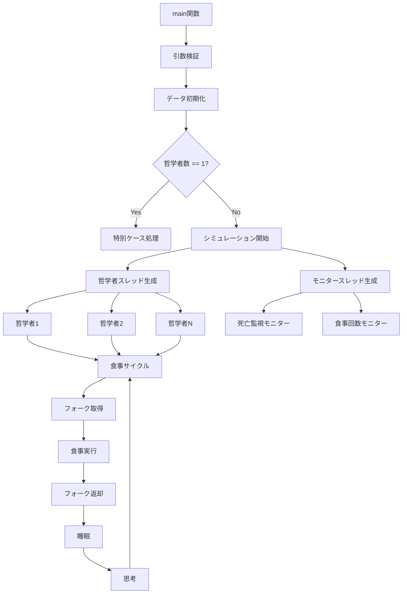
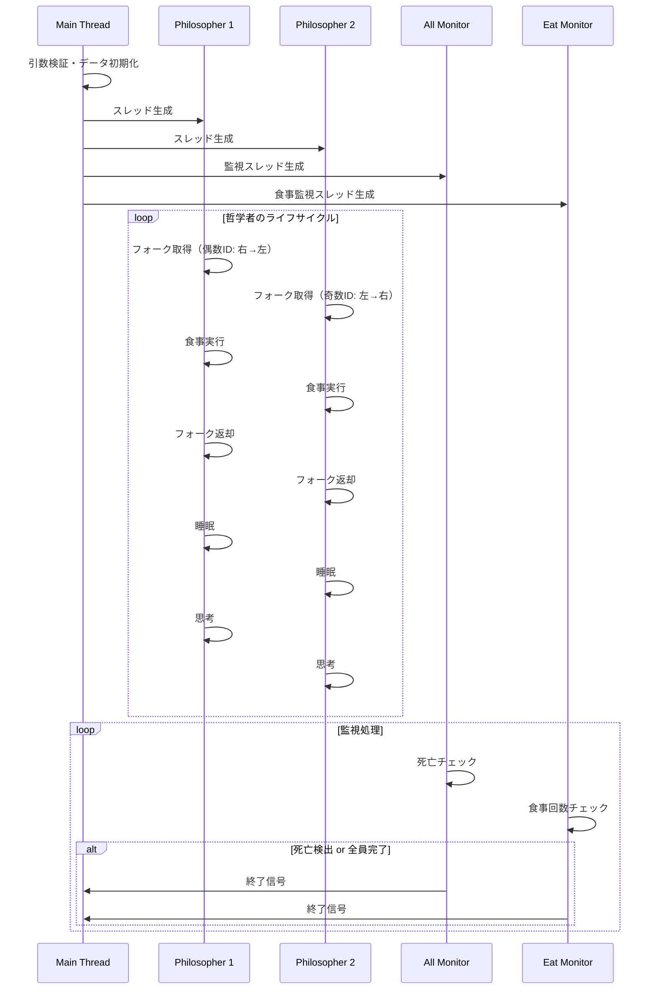

# 🍽️ Philosophers - 哲学者の食事問題

42Schoolのプロジェクト「Philosophers」の実装です。古典的な同期問題である「哲学者の食事問題」をマルチスレッドとミューテックスを使用して解決しています。

## 📋 プロジェクト概要

哲学者の食事問題は、計算機科学における有名な同期問題です。複数の哲学者が円形のテーブルに座り、食事と思考を繰り返します。各哲学者の間にはフォークが1本ずつ置かれており、食事をするためには両隣のフォークを2本とも使用する必要があります。

### 🎯 目標
- デッドロック（deadlock）の回避
- データ競合（data race）の防止  
- 哲学者が餓死しないことの保証
- 効率的なリソース管理

## 🏗️ システム構造



## 🔧 主要コンポーネント

### データ構造

#### `t_philo` - 哲学者構造体
```c
typedef struct s_philo {
    atomic_int      id;              // 哲学者ID (1-N)
    atomic_int      eat_count;       // 食事回数
    atomic_bool     is_eating;       // 食事中フラグ
    atomic_ullong   limit_time;      // 死亡制限時間
    
    pthread_mutex_t mu_this_philo;   // 個別ミューテックス
    pthread_mutex_t *mu_fork_left;   // 左フォーク
    pthread_mutex_t *mu_fork_right;  // 右フォーク
    
    struct s_data   *data;           // 共有データ参照
} t_philo;
```

#### `t_data` - 共有データ構造体
```c
typedef struct s_data {
    // 設定パラメータ
    atomic_int      num_of_philo;     // 哲学者数
    atomic_int      time_to_die;      // 死亡時間 (ms)
    atomic_int      time_to_eat;      // 食事時間 (ms)
    atomic_int      time_to_sleep;    // 睡眠時間 (ms)
    atomic_int      num_of_must_eat;  // 必須食事回数
    
    // 実行時データ
    uint64_t        start_time;       // シミュレーション開始時刻
    atomic_int      finished_count;   // 完了した哲学者数
    atomic_bool     end_flag;         // 終了フラグ
    atomic_bool     dead_flag_for_print; // 死亡時出力制御
    
    // スレッド管理
    pthread_t       *tid_philo;       // 哲学者スレッド
    pthread_t       tid_eat_monitor;  // 食事監視スレッド
    pthread_t       tid_all_monitor;  // 全体監視スレッド
    
    // 同期オブジェクト
    pthread_mutex_t *mutex_fork;      // フォークミューテックス
    pthread_mutex_t mu_printf;        // 出力用ミューテックス
    pthread_mutex_t mu_data;          // データ保護ミューテックス
} t_data;
```

### 🔄 実行フロー



## ⚙️ 主要アルゴリズム

### デッドロック回避戦略
- **偶数IDの哲学者**: 右フォーク → 左フォークの順で取得
- **奇数IDの哲学者**: 左フォーク → 右フォークの順で取得
- この非対称な取得順序により、全員が同じフォークを待つ状況を回避

### スレッドセーフな時間管理
```c
uint64_t get_int_time(void) {
    struct timeval time;
    gettimeofday(&time, NULL);
    return ((uint64_t)time.tv_sec * 1000 + 
            (uint64_t)time.tv_usec / 1000 +
            (uint64_t)(time.tv_usec % 1000 >= 500));
}
```

### 精密スリープ機能
```c
void my_sleep(int limit_time) {
    uint64_t time = get_int_time();
    while (get_int_time() < time + limit_time)
        usleep(limit_time / 10);
}
```

## 🚀 使用方法

### コンパイル
```bash
cd philo
make
```

### 実行
```bash
./philo <哲学者数> <死亡時間> <食事時間> <睡眠時間> [必須食事回数]
```

#### パラメータ説明
- `哲学者数`: 1以上の整数
- `死亡時間`: 最後の食事から死亡までの時間（ミリ秒）
- `食事時間`: 食事にかかる時間（ミリ秒）
- `睡眠時間`: 食事後の睡眠時間（ミリ秒）
- `必須食事回数`: （オプション）各哲学者の最低食事回数

### 実行例
```bash
# 基本実行: 5人の哲学者、800ms以内に食事、200ms食事時間、200ms睡眠
./philo 5 800 200 200

# 必須食事回数指定: 各哲学者が7回食事したら終了
./philo 4 410 200 200 7

# 即座死亡テスト: 1人の哲学者、200ms制限
./philo 1 200 100 100
```

## 🧪 テストケース

### 基本動作確認
```bash
./philo 5 800 200 200        # 正常動作
./philo 4 410 200 200 7      # 食事回数制限
./philo 1 200 100 100        # 単独哲学者
```

### エラーハンドリング
```bash
./philo 0 800 200 200        # 無効な哲学者数
./philo 5 -1 200 200         # 負の時間値
./philo abc 800 200 200      # 非数値引数
```

### ストレステスト
```bash
./philo 200 800 200 200      # 大量哲学者
./philo 4 310 200 200        # タイトな制限時間
```

## 🔍 監視システム

### 死亡監視 (`all_monitor`)
- 各哲学者の最終食事時刻を監視
- `time_to_die`を超過した場合、即座に死亡判定
- `is_eating`フラグで食事中の哲学者を保護

### 食事回数監視 (`eat_monitor`)
- 必須食事回数が指定された場合のみ動作
- 全哲学者が必要回数の食事を完了したら終了

## 🛠️ 技術的特徴

### アトミック操作の活用
- `atomic_int`, `atomic_bool`, `atomic_ullong`を使用
- メモリバリアを意識したデータ競合の回避

### ミューテックス戦略
- 階層化されたミューテックス設計
- 個別哲学者用、フォーク用、出力用、データ保護用の分離

### メモリ管理
- 動的メモリ割り当ての適切な管理
- `destory_data`関数での確実なリソース解放

## 📊 パフォーマンス最適化

### CPU効率
- `usleep(limit_time / 10)`による適応的スリープ
- 忙しい待機（busy waiting）の最小化

### 出力制御
- 死亡メッセージ後の出力抑制
- スレッドセーフな出力管理

## 🏆 学習成果

このプロジェクトを通じて以下の概念を習得しました：

- **並行プログラミング**: マルチスレッド環境での安全なプログラミング
- **同期プリミティブ**: ミューテックス、アトミック操作の効果的な使用
- **デッドロック回避**: 古典的な問題に対する実践的解決法
- **リソース管理**: メモリとスレッドの適切な管理
- **システム設計**: 複雑なシステムの設計と実装

## 👨‍💻 作成者

**kmiyazaw** - 42Tokyo Student

---

*このプロジェクトは42Schoolのカリキュラムの一環として作成されました。*